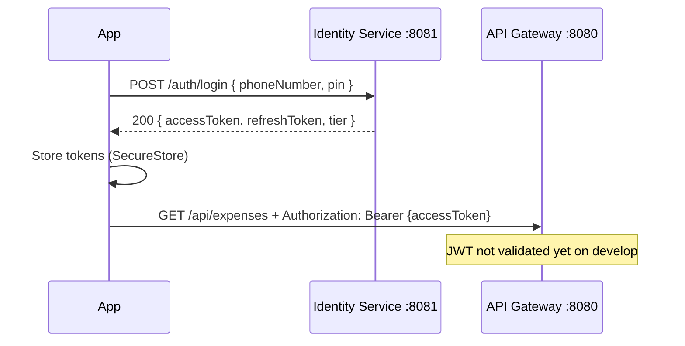

# EcoSpend Backend Handoff — Frontend API Contract

**Audience:** Mobile (React Native / Expo) engineers wiring Axios, Zustand, and React Query to the backend.  
**Baseline branch:** `develop` (backend) + frontend UI on `feature/auth-screens`, `feature/finance-screens`, `feature/vault-profile-screens`.  
**Last updated:** 2026-07-02

> This document describes the backend **as the frontend must consume it**, including gaps where UI was built against mocks or assumptions that the backend does not yet satisfy.

> ### ⚠️ Reconciliation note (2026-07-02) — read first
>
> Parts of this doc were first drafted against an earlier branch lineage. The **authoritative** state on `origin/develop` is:
>
> - **The API Gateway is live and enforces JWT.** Routing is defined in Java (`api-gateway/.../config/GatewayConfig.java`), **not** in `application.yml`. Protected routes run an `AuthenticationFilter` that validates the Bearer token and **injects `X-User-Id` and `X-User-Tier` headers** downstream. So when calling through the gateway you send only `Authorization: Bearer <token>` — you do **not** set `X-User-Id` yourself; the gateway does.
> - **Gateway routes:** `/api/auth/**` → identity (open), `/api/users/**` → identity (auth), `/api/finance/**` → expense-service (auth), `/api/vault/**` → vault-service `:8083` (auth, planned), `/api/notifications/**` → notification-service `:8084` (auth).
> - **Ports:** gateway `8080`, identity `8081`, expense/finance `8082`, **vault `8083` (reserved)**, **notification `8084`**.
> - **Compose** runs postgres + identity + expense + api-gateway + notification.
>
> Where older sections below say "no JWT validation on the gateway", "auth not routed", or list notification on `8083`, this banner supersedes them. The identity/finance/vault DTO shapes below remain the contract reference.

---

## Table of Contents

1. [Service Overview](#1-service-overview)
2. [Authentication Flow](#2-authentication-flow)
3. [Endpoint Reference](#3-endpoint-reference)
4. [Data Models / DTOs](#4-data-models--dtos)
5. [Vault-Specific Business Logic](#5-vault-specific-business-logic)
6. [Error Handling Conventions](#6-error-handling-conventions)
7. [Environment & Config](#7-environment--config)
8. [Known Gaps / Frontend Workarounds](#8-known-gaps--frontend-workarounds)
9. [Notification Service (Expo Push)](#9-notification-service-expo-push)

---

## 1. Service Overview

> **Runtime:** The EcoSpend backend is intended to run via **Docker**. From the repo root:
>
> ```bash
> cp .env.example .env   # add JWT_SECRET — see §7
> docker compose up --build
> ```
>
> `docker-compose.yml` currently starts **PostgreSQL**, **identity-service**, and **notification-service**. The other microservices have Dockerfiles under `backend/` and will be added to Compose as they are completed. Until then, run gateway/user/expense manually or extend Compose locally.

### Microservices

| # | Service | Port | Container name (Docker) | In `docker-compose.yml` | Responsibility |
|---|---------|------|-------------------------|-------------------------|----------------|
| 1 | **API Gateway** | `8080` | *(planned)* `ecospend-api-gateway` | No — Dockerfile at `backend/api-gateway/Dockerfile` | Single entry point for the mobile app. Routes `/api/users/**`, `/api/expenses/**`, `/api/notifications/**` to downstream services; exposes `GET /health`. JWT validation planned here. |
| 2 | **Identity Service** | `8081` | `ecospend-identity-service` | **Yes** | PIN-based auth for Ghana phone numbers (`/auth/*`). Issues JWT access + refresh tokens. |
| 3 | **User Service** | `8081` ⚠️ | *(planned)* `ecospend-user-service` | No — Dockerfile at `backend/user-service/Dockerfile` | Email-based user CRUD scaffold (`Long` id). **Port conflicts with identity-service** — must use a different host port in Compose. |
| 4 | **Expense Service** | `8082` | *(planned)* `ecospend-expense-service` | No — Dockerfile at `backend/expense-service/Dockerfile` | Personal expense CRUD (`/expenses`). Hosts **Finance API** (`/api/v1/finance/*`) on `feature/finance-service` branch. |
| 5 | **Notification Service** | `8084` | `ecospend-notification-service` | **Yes** | Expo push delivery + in-app notification inbox (`/notifications/*`). Stores device tokens; called service-to-service via `POST /notifications/send`. See [§9](#9-notification-service-expo-push). |
| 6 | **Vault Service** | `8083` *(reserved)* | — | **Not implemented** | Personal vaults, group vaults (susu), withdrawal penalties. **No code yet**, but the gateway already routes `/api/vault/**` → `vault-service:8083`. Vault UI uses mocks. |

**Infrastructure (Docker):**

| Service | Port | Container name | In Compose | Responsibility |
|---------|------|----------------|------------|----------------|
| **PostgreSQL** | `5432` | `ecospend-db` | **Yes** | Shared database (`postgres:16-alpine`). Identity-service connects via `jdbc:postgresql://postgres:5432/...`. |

### Routing & base URLs

| Service | Base URL (direct) | Gateway path prefix |
|---------|-------------------|---------------------|
| API Gateway | `http://localhost:8080` | — |
| Identity Service | `http://localhost:8081` | **Not routed** — call direct or add `/api/auth/**` gateway route |
| User Service | `http://localhost:8081` ⚠️ | `/api/users/**` → strips `/api` |
| Expense / Finance | `http://localhost:8082` | `/api/expenses/**` → strips `/api`; finance at `/api/v1/finance/*` *(branch only, not routed)* |
| Notification Service | `http://localhost:8084` | `/api/notifications/**` → strips `/api` |
| Vault Service | — | `/api/v1/vault/**` *(planned)* |

### Recommended frontend base URL

```text
EXPO_PUBLIC_API_URL=http://localhost:8080/api
```

Auth endpoints are **not** behind this prefix today. Until gateway routing is added, auth calls go to:

```text
EXPO_PUBLIC_AUTH_URL=http://localhost:8081
```

---

## 2. Authentication Flow

### 2.1 Overview

EcoSpend uses **phone + PIN** (not email/password). The identity service returns a short-lived **access token** (JWT) and a long-lived **refresh token** (JWT + DB row).

| Token | Default TTL | Config key | JWT claim `type` | Other claims |
|-------|-------------|------------|------------------|--------------|
| Access | **15 minutes** | `jwt.expiry-ms` = `900000` | `"access"` | `sub` = user UUID, `tier` = e.g. `"FREE"` |
| Refresh | **7 days** | `jwt.refresh-expiry-ms` = `604800000` | `"refresh"` | `sub` = user UUID |

Algorithm: **HS512**. Signing key: `JWT_SECRET` env var — must be a **Base64-encoded** string (see [§8](#8-known-gaps--frontend-workarounds)).

### 2.2 Login flow



### 2.3 Axios interceptor contract

Configure a dedicated auth client or shared instance:

```typescript
// Request interceptor — attach to all protected calls
axiosInstance.interceptors.request.use((config) => {
  const accessToken = tokenStore.getAccessToken();
  if (accessToken) {
    config.headers.Authorization = `Bearer ${accessToken}`;
  }
  config.headers['Content-Type'] = 'application/json';
  return config;
});
```

**Required header for protected endpoints (when enforced):**

```http
Authorization: Bearer <accessToken>
Content-Type: application/json
```

> On `develop`, user/expense endpoints do **not** validate this header. Finance endpoints on `feature/finance-service` use `X-User-Id: <uuid>` instead (see [§8](#8-known-gaps--frontend-workarounds)).

### 2.4 Token refresh on 401

When any protected request returns **401**, attempt refresh **once**, then retry the original request:

```typescript
axiosInstance.interceptors.response.use(
  (res) => res,
  async (error) => {
    const original = error.config;
    if (error.response?.status === 401 && !original._retry) {
      original._retry = true;
      const refreshToken = tokenStore.getRefreshToken();
      if (!refreshToken) throw error;

      const { data } = await authClient.post('/auth/refresh', { refreshToken });
      tokenStore.setTokens(data.accessToken, data.refreshToken);
      original.headers.Authorization = `Bearer ${data.accessToken}`;
      return axiosInstance(original);
    }
    throw error;
  },
);
```

#### `POST /auth/refresh`

| | |
|---|---|
| **URL** | `{AUTH_BASE}/auth/refresh` |
| **Auth** | None |
| **Body** | `{ "refreshToken": string }` |

**Success `200`:**

```json
{
  "accessToken": "eyJhbG...",
  "refreshToken": "eyJhbG...",
  "tier": "FREE"
}
```

**Refresh behaviour:** The **same** `refreshToken` is returned (not rotated). Only `accessToken` is regenerated.

**Failure `401`:**

```json
{
  "code": "INVALID_CREDENTIALS",
  "message": "Invalid or expired refresh token",
  "status": 401,
  "timestamp": "2026-07-02T12:00:00Z"
}
```

On refresh failure → clear tokens, navigate to login.

#### `POST /auth/logout`

| | |
|---|---|
| **URL** | `{AUTH_BASE}/auth/logout` |
| **Body** | `{ "refreshToken": string }` |
| **Success** | `204 No Content` (empty body) |

Deletes the refresh token row from DB. Client should also clear local token storage.

### 2.5 Register + Login endpoints

#### `POST /auth/register`

**Request:**

```json
{
  "phoneNumber": "0241234567",
  "name": "Ama Boateng",
  "pin": "1234"
}
```

| Field | Type | Required | Validation |
|-------|------|----------|------------|
| `phoneNumber` | string | yes | Ghana format: `^(0\|+233)[0-9]{9}$` |
| `name` | string | yes | 2–100 chars |
| `pin` | string | yes | 4–6 digits |

**Success `201`:** Same shape as login (`AuthResponse`).

**Errors:** `409 DUPLICATE_PHONE`, `400 VALIDATION_ERROR`.

#### `POST /auth/login`

**Request:**

```json
{
  "phoneNumber": "0241234567",
  "pin": "1234"
}
```

**Success `200`:**

```json
{
  "accessToken": "eyJhbG...",
  "refreshToken": "eyJhbG...",
  "tier": "FREE"
}
```

**Error `401`:** Always `"Invalid phone number or PIN"` — intentionally non-revealing.

### 2.6 Mapping to frontend auth screens

The UI on `feature/auth-screens` currently uses **mock auth** with a different contract:

| Frontend (`useLogin`, `mock/auth.ts`) | Backend (identity-service) |
|---------------------------------------|----------------------------|
| Field `password` | Field **`pin`** |
| Response `{ token, user: { name, phone } }` | Response **`{ accessToken, refreshToken, tier }`** — no `user` object |
| Single `token` | Separate access + refresh tokens |
| No refresh flow | Must implement `/auth/refresh` |

**Zustand auth store should persist:**

```typescript
interface AuthState {
  accessToken: string | null;
  refreshToken: string | null;
  tier: string;           // from AuthResponse.tier
  // Derive display user from login/register form or add GET /users/me (not implemented)
}
```

---

## 3. Endpoint Reference

### Legend

- **Gateway URL** = `{EXPO_PUBLIC_API_URL}` + path (default `http://localhost:8080/api`)
- **Direct URL** = service port, no `/api` prefix
- Unless noted, no auth headers are enforced on `develop`

---

### 3.1 API Gateway

#### `GET /health`

| | |
|---|---|
| **URL** | `http://localhost:8080/health` |
| **Auth** | None |

**Success `200`:**

```json
{
  "status": "ok",
  "service": "api-gateway"
}
```

---

### 3.2 Identity Service — `/auth/*`

> **Reachability:** Direct only at `http://localhost:8081/auth/*`. Not proxied through gateway on `develop`.

All endpoints: `Content-Type: application/json`, no `Authorization` header.

Endpoints documented in [§2.5](#25-register--login-endpoints) and [§2.4](#24-token-refresh-on-401).

---

### 3.3 User Service — `/users`

Routed: `GET|POST {GATEWAY}/users` → `http://localhost:8081/users`

#### `GET /users`

**Success `200`:** Array of `User` (user-service model — see [§4.3](#43-user-service-user)).

```json
[
  {
    "id": 1,
    "email": "user@example.com",
    "name": "Test User",
    "createdAt": "2026-01-15T10:30:00"
  }
]
```

#### `POST /users`

**Request:**

```json
{
  "email": "user@example.com",
  "name": "Test User"
}
```

**Success `200`:** Created `User` with server-assigned `id` and `createdAt`.

**Errors:** Spring default (no custom envelope) — typically `500` if DB table missing.

> ⚠️ This service is a **separate user model** from identity-service (email/`Long` vs phone/UUID). Do not treat these as the authenticated app user.

---

### 3.4 Expense Service — `/expenses` *(develop)*

Routed: `GET|POST {GATEWAY}/expenses` → `http://localhost:8082/expenses`

#### `GET /expenses`

| Query | Type | Required |
|-------|------|----------|
| `userId` | number (`Long`) | no — omit to return all |

**Success `200`:**

```json
[
  {
    "id": 1,
    "userId": 1,
    "amount": 25.50,
    "category": "Food",
    "description": "Lunch",
    "spentAt": "2026-06-01",
    "createdAt": "2026-06-01T14:22:00"
  }
]
```

#### `POST /expenses`

**Request:**

```json
{
  "userId": 1,
  "amount": 25.50,
  "category": "Food",
  "description": "Lunch",
  "spentAt": "2026-06-01"
}
```

**Success `200`:** Created `Expense` with `id` and `createdAt`.

**Errors:** Spring default — no validation, no custom error envelope.

> Used by `mobile/src/services/api.js` on `develop`. The finance-screens UI does **not** call these endpoints — it uses a separate `Transaction` model with mock data.

---

### 3.5 Finance API — `/api/v1/finance/*` *(branch: `feature/finance-service` only)*

> **Not merged to `develop`.** Documented here because finance-screens UI will wire to these shapes.

Base path on expense-service: `http://localhost:8082/api/v1/finance`

**Auth pattern on this branch:** `X-User-Id: <UUID>` header (identity user id) — **not** `Authorization: Bearer`.

#### `GET /api/v1/finance/momo-fee`

| Query | Type | Required |
|-------|------|----------|
| `amount` | decimal | yes |
| `provider` | string | yes — `"MTN"` or `"TELECEL"` |

**Success `200`:** Raw decimal (not wrapped in JSON object).

```json
5.00
```

**Fee logic:** 1% of amount, capped at GHS 10.00 for MTN/Telecel. Other providers → `0`.

#### `POST /api/v1/finance/transactions`

**Headers:** `X-User-Id: <uuid>`

**Request:**

```json
{
  "amount": 150.00,
  "type": "EXPENSE",
  "provider": "MTN",
  "category": "Food",
  "notes": "Market run"
}
```

**Success `200`:** Saved `Transaction` — server sets `userId`, `momoFee`, `id`, `createdAt`.

```json
{
  "id": "550e8400-e29b-41d4-a716-446655440000",
  "userId": "550e8400-e29b-41d4-a716-446655440001",
  "amount": 150.00,
  "momoFee": 1.50,
  "type": "EXPENSE",
  "provider": "MTN",
  "category": "Food",
  "notes": "Market run",
  "createdAt": "2026-06-01T14:22:00+00:00"
}
```

#### `GET /api/v1/finance/transactions`

**Headers:** `X-User-Id: <uuid>`

**Success `200`:** `Transaction[]`

#### `POST /api/v1/finance/goals`

**Headers:** `X-User-Id: <uuid>`

**Request:**

```json
{
  "name": "Emergency Fund",
  "targetAmount": 5000.00,
  "currentAmount": 0,
  "deadline": "2026-12-31"
}
```

**Success `200`:** Saved `SavingsGoal`

#### `GET /api/v1/finance/goals`

**Headers:** `X-User-Id: <uuid>`

**Success `200`:** `SavingsGoal[]`

#### `PUT /api/v1/finance/goals/{id}`

**Headers:** `X-User-Id: <uuid>`

**Request:** Partial `SavingsGoal` — updates `name`, `targetAmount`, `currentAmount`

**Success `200`:** Updated goal  
**Error `404`:** Empty body if not found or wrong user

#### `DELETE /api/v1/finance/goals/{id}`

**Headers:** `X-User-Id: <uuid>`

**Success `204`:** Empty  
**Error `404`:** Empty

#### `POST /api/v1/finance/envelopes`

**Headers:** `X-User-Id: <uuid>`

**Request:**

```json
{
  "category": "Food",
  "budgetLimit": 800.00,
  "month": 6,
  "year": 2026
}
```

**Success `200`:** Saved `BudgetEnvelope`

#### `GET /api/v1/finance/envelopes`

**Headers:** `X-User-Id: <uuid>`

**Success `200`:** `BudgetEnvelope[]`

---

### 3.6 Vault Service — **NOT IMPLEMENTED**

The frontend on `feature/vault-profile-screens` expects the endpoints below. **None exist in any backend branch.**

| Expected endpoint | Used by |
|-------------------|---------|
| `GET /vaults` | `useVaultDashboard` |
| `GET /vaults/{id}` | `useVaultDetails` |
| `POST /vaults` | `useCreateVault` |
| `POST /vaults/{id}/contributions` | Create/top-up flows |
| `POST /vaults/{id}/withdraw` | `useWithdrawVault` |
| `GET /vaults/{id}/history` | `useVaultHistory` |
| `GET /group-vaults` | `useGroupVaultDashboard` |
| `GET /group-vaults/{id}` | `useGroupVaultDetails` |
| `POST /group-vaults` | `useCreateGroupVault` |
| `POST /group-vaults/join` | `JoinGroupVaultScreen` |
| `GET /group-vaults/withdrawal-requests` | `WithdrawalApprovalScreen` |
| `POST /group-vaults/withdrawal-requests/{id}/vote` | Approval flow |

See [§5](#5-vault-specific-business-logic) for the data shapes the UI expects.

---

## 4. Data Models / DTOs

Field names match **JSON serialization** (Jackson default: camelCase for Java records/beans).

---

### 4.1 Identity — Auth DTOs

#### `RegisterRequest`

| Field | JSON type | Nullable | Notes |
|-------|-----------|----------|-------|
| `phoneNumber` | string | no | `0241234567` or `+233241234567` |
| `name` | string | no | |
| `pin` | string | no | 4–6 digits; never returned in responses |

#### `LoginRequest`

| Field | JSON type | Nullable |
|-------|-----------|----------|
| `phoneNumber` | string | no |
| `pin` | string | no |

#### `RefreshRequest`

| Field | JSON type | Nullable |
|-------|-----------|----------|
| `refreshToken` | string | no |

#### `AuthResponse`

| Field | JSON type | Nullable |
|-------|-----------|----------|
| `accessToken` | string | no |
| `refreshToken` | string | no |
| `tier` | string | no | e.g. `"FREE"` |

#### `ErrorResponse` *(identity-service only)*

| Field | JSON type | Nullable |
|-------|-----------|----------|
| `code` | string | no |
| `message` | string | no |
| `status` | number | no |
| `timestamp` | string | no | ISO-8601 instant |

---

### 4.2 Identity — User entity *(not exposed via REST yet)*

Stored in identity DB; useful for future `GET /users/me`.

| Field | JSON type | Nullable | Notes |
|-------|-----------|----------|-------|
| `id` | string (UUID) | no | |
| `phoneNumber` | string | no | |
| `name` | string | no | |
| `email` | string | yes | |
| `subscriptionTier` | string | no | default `"FREE"` |
| `pushToken` | string | yes | |
| `isActive` | boolean | no | |
| `createdAt` | string (datetime) | no | |
| `updatedAt` | string (datetime) | no | |

`pinHash` is never serialized to clients.

---

### 4.3 User Service — `User`

| Field | JSON type | Nullable |
|-------|-----------|----------|
| `id` | number | no |
| `email` | string | no |
| `name` | string | no |
| `createdAt` | string (datetime) | yes |

---

### 4.4 Expense Service — `Expense` *(develop scaffold)*

| Field | JSON type | Nullable |
|-------|-----------|----------|
| `id` | number | no |
| `userId` | number | no |
| `amount` | number | no | `BigDecimal` → JSON number |
| `category` | string | no | |
| `description` | string | yes | |
| `spentAt` | string (date) | no | `"YYYY-MM-DD"` |
| `createdAt` | string (datetime) | yes | |

---

### 4.5 Finance — `Transaction` *(feature/finance-service)*

| Field | JSON type | Nullable | Frontend mapping |
|-------|-----------|----------|------------------|
| `id` | string (UUID) | no | Frontend `id: string` ✓ |
| `userId` | string (UUID) | no | — |
| `amount` | number | no | ✓ |
| `momoFee` | number | yes | Not in frontend `Transaction` — add or ignore |
| `type` | string | no | **`"INCOME"` \| `"EXPENSE"`** — frontend uses lowercase `"income"` \| `"expense"` |
| `provider` | string | yes | **`"MTN"` \| `"TELECEL"`** — frontend uses `"MTN MoMo"` \| `"Telecel Cash"` \| `"AT Money"` |
| `category` | string | yes | ✓ (enum overlap on categories) |
| `notes` | string | yes | Frontend field `notes` ✓ |
| `createdAt` | string (offset datetime) | yes | Frontend field **`date`** — map in adapter |

---

### 4.6 Finance — `SavingsGoal` *(feature/finance-service)*

| Field | JSON type | Nullable | Frontend mapping |
|-------|-----------|----------|------------------|
| `id` | string (UUID) | no | ✓ |
| `userId` | string (UUID) | no | — |
| `name` | string | no | ✓ |
| `targetAmount` | number | no | ✓ |
| `currentAmount` | number | no | ✓ |
| `deadline` | string (date) \| null | yes | Frontend `deadline: string \| null` ✓ |
| `createdAt` | string (offset datetime) | no | ✓ |

**Frontend-only fields (no backend equivalent yet):** `color`, `completedAt`, `GoalContribution` history.

---

### 4.7 Finance — `BudgetEnvelope` *(feature/finance-service)*

| Field | JSON type | Nullable | Frontend `Envelope` mapping |
|-------|-----------|----------|----------------------------|
| `id` | string (UUID) | no | ✓ |
| `userId` | string (UUID) | no | — |
| `category` | string | no | ✓ |
| `budgetLimit` | number | no | Frontend **`monthlyLimit`** |
| `currentSpent` | number | no | Frontend **`currentSpend`** |
| `month` | number | no | ✓ |
| `year` | number | no | ✓ |
| `createdAt` | string (offset datetime) | yes | — |

**Frontend-only fields:** `emoji`, `color`, computed `EnvelopeStatus`.

---

### 4.8 Vault — Frontend types *(no backend yet)*

These are the exact TypeScript interfaces from `feature/vault-profile-screens` that future vault-service DTOs should match.

#### `Vault`

| Field | Type | Nullable |
|-------|------|----------|
| `id` | string | no |
| `name` | string | no |
| `currentBalance` | number | no |
| `targetAmount` | number | no |
| `maturityDate` | string (ISO date) | no |
| `createdDate` | string (ISO date) | no |
| `estimatedWithdrawalFee` | number | no |
| `status` | `"active"` \| `"locked"` \| `"matured"` \| `"pending"` \| `"withdrawn"` | no |
| `accentColor` | string | no |
| `contributions` | `VaultContribution[]` | no |
| `withdrawalDate` | string | yes | withdrawn vaults only |
| `feeCharged` | number | yes | withdrawn vaults only |

#### `VaultContribution`

| Field | Type | Nullable |
|-------|------|----------|
| `id` | string | no |
| `date` | string (ISO date) | no |
| `amount` | number | no |
| `note` | string | yes |

#### `VaultSummary`

| Field | Type | Nullable |
|-------|------|----------|
| `totalBalance` | number | no |
| `activeVaultCount` | number | no |
| `nextMaturityDate` | string \| null | yes |

#### `GroupVault`

| Field | Type | Nullable |
|-------|------|----------|
| `id` | string | no |
| `name` | string | no |
| `goalName` | string | no |
| `description` | string | no |
| `amountSaved` | number | no |
| `targetAmount` | number | no |
| `maturityDate` | string | no |
| `createdDate` | string | no |
| `status` | `"active"` \| `"locked"` \| `"matured"` \| `"closed"` | no |
| `accentColor` | string | no |
| `members` | `GroupVaultMember[]` | no |
| `myContribution` | number | no |

#### `GroupVaultMember`

| Field | Type | Nullable |
|-------|------|----------|
| `id` | string | no |
| `name` | string | no |
| `initials` | string | no |
| `role` | `"admin"` \| `"member"` | no |
| `lastContribution` | string | yes |

#### `WithdrawalRequest`

| Field | Type | Nullable |
|-------|------|----------|
| `id` | string | no |
| `groupVaultId` | string | no |
| `groupVaultName` | string | no |
| `requestedBy` | `GroupVaultMember` | no |
| `amount` | number | no |
| `reason` | string | no |
| `requestedDate` | string | no |
| `votesFor` | number | no |
| `votesAgainst` | number | no |
| `requiredVotes` | number | no |
| `status` | `"pending"` \| `"approved"` \| `"rejected"` | no |
| `hasVoted` | boolean | no |

#### `GroupVaultSummary`

| Field | Type | Nullable |
|-------|------|----------|
| `totalGroupSavings` | number | no |
| `activeGroups` | number | no |
| `pendingApprovals` | number | no |

---

## 5. Vault-Specific Business Logic

### 5.1 Status — **backend not implemented**

All penalty and vault logic currently lives **client-side** in `feature/vault-profile-screens`. The backend must eventually own authoritative calculations on withdrawal; until then, the frontend preview logic below is the product spec.

### 5.2 Personal vault penalty fees

Constants in `useCreateVault.ts` / `useWithdrawVault.ts`:

| Scenario | Rate | Applied to | Net payout |
|----------|------|------------|------------|
| **On-time withdrawal** (matured or `daysRemaining <= 0`) | **2%** (`0.02`) | `currentBalance` | `balance - (balance × 0.02)` |
| **Early exit** (before maturity) | **5%** (`0.05`) | `currentBalance` | `balance - (balance × 0.05)` |

**Frontend preview (create vault):** Uses `lockedAmount = initialDeposit > 0 ? initialDeposit : targetAmount` to estimate fees before submit.

**Frontend preview (withdraw):**

```typescript
const withdrawalType = vault.status === 'matured' || daysRemaining <= 0 ? 'matured' : 'early';
const feeRate = withdrawalType === 'matured' ? 0.02 : 0.05;
const feeAmount = vault.currentBalance * feeRate;
const netAmount = vault.currentBalance - feeAmount;
```

**What backend must eventually return on withdraw:**

```json
{
  "vaultId": "vault-emergency",
  "withdrawalType": "early",
  "balance": 8500,
  "feeRate": 0.05,
  "feeAmount": 425,
  "netAmount": 8075,
  "status": "withdrawn",
  "withdrawalDate": "2026-07-02",
  "feeCharged": 425
}
```

**What frontend should do now:** Keep client-side preview; when API exists, **display backend numbers on confirm** and treat server response as source of truth.

### 5.3 Vault statuses

| Status | Meaning in UI |
|--------|---------------|
| `active` | Accepting contributions; before maturity |
| `locked` | No new contributions; awaiting maturity |
| `matured` | Past maturity date; on-time withdrawal available |
| `pending` | Reserved for in-flight operations |
| `withdrawn` | Closed; `withdrawalDate` + `feeCharged` populated |

### 5.4 Group vault (susu) mechanics — UI representation

No backend implementation. The UI models susu as:

**Contributions:** Aggregated into `amountSaved` (group total) and `myContribution` (current user). Per-member `lastContribution` date on `GroupVaultMember`.

**Membership:** `members[]` with `role: "admin" | "member"`. Admin creates vault; members join via invite code (UI only).

**Payout / withdrawal:** Not rotation-based in current UI — instead uses **multi-member approval voting**:

- Member submits `WithdrawalRequest` with `amount`, `reason`
- Other members vote; `requiredVotes` threshold must be met
- `votesFor` / `votesAgainst` / `hasVoted` drive approval screens
- No turn-order / slot rotation field exists in frontend types

**When backend implements group vaults**, recommended additions to API responses:

```typescript
// Suggested future fields (not in current UI types)
rotationOrder?: number;        // member's payout slot
currentPayoutMemberId?: string;
contributionSchedule?: 'daily' | 'weekly' | 'monthly';
```

Until then, wire UI to mock data in `ecospend-mobile/src/data/mock/groupVaults.ts`.

### 5.5 MoMo fee calculator — finance screens

Frontend (`utils/fees.ts`) uses **tiered mock schedules** per provider display name.

Backend (`MomoFeeService` on `feature/finance-service`) uses a simpler rule: **1% capped at GHS 10** for `MTN` / `TELECEL`.

**Adapter needed:**

```typescript
const PROVIDER_TO_API: Record<Provider, string> = {
  'MTN MoMo': 'MTN',
  'Telecel Cash': 'TELECEL',
  'AT Money': 'AT',  // backend returns 0 fee today
};
```

---

## 6. Error Handling Conventions

### 6.1 Identity service — standard envelope

All handled exceptions from identity-service return:

```json
{
  "code": "ERROR_CODE",
  "message": "Human-readable message",
  "status": 400,
  "timestamp": "2026-07-02T12:00:00Z"
}
```

| HTTP | `code` | When |
|------|--------|------|
| 400 | `VALIDATION_ERROR` | Bean validation failure |
| 401 | `INVALID_CREDENTIALS` | Bad login, bad/expired refresh token |
| 409 | `DUPLICATE_PHONE` | Register with existing phone |
| 500 | `INTERNAL_ERROR` | Unhandled exception |

### 6.2 Validation error shape — identity only

Validation returns **only the first field error** in `message`:

```json
{
  "code": "VALIDATION_ERROR",
  "message": "phoneNumber: Invalid Ghanaian phone number",
  "status": 400,
  "timestamp": "2026-07-02T12:00:00Z"
}
```

**Frontend form mapping:** Parse `"fieldName: message"` from `message` string, or map known `code` values:

```typescript
function mapAuthError(error: ErrorResponse, field: string): string | undefined {
  if (error.code === 'VALIDATION_ERROR' && error.message.startsWith(`${field}:`)) {
    return error.message.split(': ').slice(1).join(': ');
  }
  if (error.code === 'DUPLICATE_PHONE' && field === 'phoneNumber') {
    return error.message;
  }
  if (error.code === 'INVALID_CREDENTIALS') {
    return 'Invalid phone number or PIN';
  }
  return undefined;
}
```

There is **no** `errors[]` array. Do not expect RFC 7807 Problem Details.

### 6.3 User / expense / finance services

No `GlobalExceptionHandler` on `develop`. Unhandled errors return Spring Boot default:

```json
{
  "timestamp": "2026-07-02T12:00:00Z",
  "status": 500,
  "error": "Internal Server Error",
  "path": "/expenses"
}
```

Finance endpoints return **empty body** on `404`.

---

## 7. Environment & Config

### 7.1 Frontend environment variables

| Variable | Required | Default | Purpose |
|----------|----------|---------|---------|
| `EXPO_PUBLIC_API_URL` | recommended | `http://localhost:8080/api` | Gateway-backed resources (`/users`, `/expenses`, `/notifications`) |
| `EXPO_PUBLIC_AUTH_URL` | recommended | `http://localhost:8081` | Identity `/auth/*` (until gateway route added) |

No API keys required on `develop`. No staging/prod URLs are configured in repo — replace localhost when deploying.

**Android emulator note:** Use `http://10.0.2.2:8080/api` (gateway) and `http://10.0.2.2:8081` (auth) instead of `localhost`.

**Physical device note:** Use your machine's LAN IP.

### 7.2 Backend / Docker (`.env.example`)

```env
POSTGRES_DB=ecospend
POSTGRES_USER=ecospend
POSTGRES_PASSWORD=ecospend_dev
POSTGRES_PORT=5432
USER_SERVICE_PORT=8081
EXPENSE_SERVICE_PORT=8082
NOTIFICATION_SERVICE_PORT=8084
USER_SERVICE_URL=http://localhost:8081
EXPENSE_SERVICE_URL=http://localhost:8082
NOTIFICATION_SERVICE_URL=http://localhost:8084

# Notification service (Expo Push) — only needed if the Expo project has
# "Enhanced Security for Push Notifications" enabled; blank otherwise.
EXPO_ACCESS_TOKEN=
```

**Also required for identity (in `docker-compose.yml` but missing from `.env.example`):**

```env
JWT_SECRET=<base64-encoded-512-bit-key>
JWT_EXPIRY_MS=900000
JWT_REFRESH_EXPIRY_MS=604800000
IDENTITY_SERVICE_PORT=8081
```

### 7.3 Service ports summary

| Environment | Gateway | Identity | User | Expense | Vault | Notification |
|-------------|---------|----------|------|---------|-------|--------------|
| Local dev | `:8080` | `:8081` | `:8081` ⚠️ | `:8082` | `:8083` *(reserved)* | `:8084` |
| Docker Compose (`develop`) | `:8080` | `:8081` | not included | `:8082` | not built | `:8084` |

Staging/prod URLs are **not defined in this repository**.

---

## 8. Known Gaps / Frontend Workarounds

### 8.1 Critical blockers

| Gap | Impact | Workaround |
|-----|--------|------------|
| **Vault service missing entirely** | All vault/group-vault screens use mocks | Keep mock hooks until vault-service ships; types in §4.8 are the contract target |
| **Auth not routed through gateway** | `EXPO_PUBLIC_API_URL` cannot reach `/auth/*` | Use separate `EXPO_PUBLIC_AUTH_URL` or add gateway route |
| **No JWT validation on gateway** | `Authorization` header ignored | Still send it — prepare interceptors now; enforcement coming |
| **Port 8081 conflict** | identity-service and user-service cannot co-run | Change one port locally; only run the service you need |
| **Two incompatible User models** | identity UUID/phone vs user-service Long/email | Authenticated app user = identity model; ignore user-service for auth flows |
| **`feature/finance-service` not merged** | Finance UI has no live API | Merge branch or develop against mock until merged |
| **Finance uses `X-User-Id` not JWT** | Axios interceptor alone insufficient for finance | Pass UUID from JWT `sub` claim until gateway extracts it |

### 8.2 Frontend ↔ backend field mismatches

| Area | Frontend expects | Backend provides | Action |
|------|------------------|------------------|--------|
| Login | `password` | `pin` | Rename field in API payload |
| Auth response | `{ token, user }` | `{ accessToken, refreshToken, tier }` | Update Zustand store + SecureStore keys |
| Transaction type | `"income"` / `"expense"` | `"INCOME"` / `"EXPENSE"` | Case adapter |
| Transaction date | `date` | `createdAt` | Map in React Query `select` |
| Provider | `"MTN MoMo"` | `"MTN"` | Map via lookup table |
| MoMo fees | Tiered mock schedules | 1% cap GHS 10 | Use API for truth when available; keep mock as fallback |
| Envelope | `monthlyLimit`, `currentSpend`, `emoji` | `budgetLimit`, `currentSpent`, no emoji | Adapter + default emoji client-side |
| Savings goal | `color`, `completedAt` | not stored | Derive `completedAt` when `currentAmount >= targetAmount` client-side |
| Expense scaffold | `userId: number` | Identity user is UUID | Do not wire expense scaffold to authenticated user without migration |

### 8.3 Frontend infrastructure gaps (in repo)

| Expected (per project brief) | Actual on branches |
|------------------------------|-------------------|
| Axios + JWT interceptors | **Not implemented** — mock auth + native `fetch` in `mobile/src/services/api.js` only |
| Zustand stores | **Not implemented** — React Context on feature branches |
| React Query | **Not implemented** — hooks use mock data + `setTimeout` |
| TypeScript | **`ecospend-mobile/` feature branches** — yes; **`mobile/` on develop** — JavaScript only |

### 8.4 Endpoints UI expects but backend lacks

| Frontend hook / screen | Expected API | Status |
|------------------------|--------------|--------|
| `useLogin`, `useRegister` | `POST /auth/login`, `/auth/register` | ✅ Backend ready (identity-service) — UI uses mock |
| `useTransactions`, `useAddTransaction` | Finance transaction CRUD | ⏳ On `feature/finance-service` branch only |
| `useSavingsGoals` | Goals CRUD | ⏳ Branch only |
| `useBudgetEnvelopes` | Envelopes CRUD | ⏳ Branch only; no PUT/DELETE yet |
| `useMoMoCalculator` | `GET /api/v1/finance/momo-fee` | ⏳ Branch only; fee logic differs from UI |
| `useVaultDashboard` | `GET /vaults` | ❌ Not implemented |
| `useCreateVault` | `POST /vaults` | ❌ Not implemented |
| `useWithdrawVault` | `POST /vaults/{id}/withdraw` | ❌ Not implemented |
| `useGroupVaultDashboard` | `GET /group-vaults` | ❌ Not implemented |
| `WithdrawalApprovalScreen` | Withdrawal request + vote APIs | ❌ Not implemented |
| Profile screen | `GET /users/me` | ❌ Not implemented |
| Push token registration, notification inbox | `POST /notifications/tokens`, `GET /notifications`, … | ✅ Backend ready (notification-service) — see [§9](#9-notification-service-expo-push) |

### 8.5 JWT secret encoding

`JwtService` decodes `JWT_SECRET` as **Base64**. The default in `application.properties` is plain text and will fail at runtime. Generate properly:

```bash
openssl rand -base64 64
```

Set in `.env` before running identity-service.

### 8.6 Suggested React Query key structure (when wiring)

```typescript
// Auth
['auth', 'session']

// Finance (post-merge)
['transactions', userId]
['goals', userId]
['envelopes', userId, month, year]
['momo-fee', amount, provider]

// Vault (future)
['vaults', userId]
['vault', vaultId]
['group-vaults', userId]
['group-vault', groupVaultId]
['withdrawal-requests', userId]
```

---

## 9. Notification Service (Expo Push)

**Module:** `backend/notification-service` · **Port:** `8084` · **In Compose:** yes (`ecospend-notification-service`)

The notification service owns two things:

1. **The Expo device-token registry** — which Expo push tokens belong to which user (a user may register several devices).
2. **The in-app notification inbox** — every notification is persisted so the app can render a notification centre and an unread badge, independently of whether the OS-level push was delivered.

Push delivery is a **best-effort side effect**: `POST /notifications/send` always persists the inbox row first, then attempts Expo delivery. A push failure never fails the call.

### 9.1 Auth pattern

User-scoped endpoints identify the caller with the **`X-User-Id: <uuid>`** header (the identity user's UUID). On `develop` the API Gateway's `AuthenticationFilter` **already injects this header** (plus `X-User-Tier`) from the validated JWT `sub` claim — so from the app you send only `Authorization: Bearer <token>` through the gateway and never set `X-User-Id` yourself. When calling the service directly (bypassing the gateway) you must supply it. Missing/invalid header → `400 MISSING_USER_ID`.

`POST /notifications/send` is **service-to-service** (userId in the body). Backend services call it directly at `http://notification-service:8084/notifications/send`; it should not be reached by the mobile app.

### 9.2 Endpoint reference

Routed: `{GATEWAY}/api/notifications/**` → `http://notification-service:8084/notifications/**` (StripPrefix=1, JWT-protected). Direct base: `http://localhost:8084`.

| Method | Path | Auth | Purpose |
|--------|------|------|---------|
| `POST` | `/notifications/tokens` | `X-User-Id` | Register / re-point an Expo push token (idempotent upsert) |
| `DELETE` | `/notifications/tokens/{expoPushToken}` | none | Unregister a device token (call on logout) |
| `GET` | `/notifications?unreadOnly=false` | `X-User-Id` | List the caller's notifications, newest first |
| `GET` | `/notifications/unread-count` | `X-User-Id` | `{ "count": N }` for the badge |
| `PATCH` | `/notifications/{id}/read` | `X-User-Id` | Mark one as read → returns the updated notification |
| `POST` | `/notifications/read-all` | `X-User-Id` | Mark all as read → `204` |
| `DELETE` | `/notifications/{id}` | `X-User-Id` | Delete one → `204` |
| `POST` | `/notifications/send` | none *(internal)* | Persist + push to all of a user's devices |

#### `POST /notifications/tokens`

**Headers:** `X-User-Id: <uuid>`

**Request:**

```json
{
  "expoPushToken": "ExponentPushToken[xxxxxxxxxxxxxxxxxxxxxx]",
  "platform": "android",
  "deviceId": "optional-device-identifier"
}
```

| Field | Type | Required | Validation |
|-------|------|----------|------------|
| `expoPushToken` | string | yes | Must match `ExponentPushToken[...]` or `ExpoPushToken[...]` |
| `platform` | string | no | `"ios"` \| `"android"` (free-form) |
| `deviceId` | string | no | Stable per-device id for de-duplication |

**Success `204 No Content`.** Re-sending the same token just re-points it to the current user (idempotent).

#### `GET /notifications`

| Query | Type | Required | Default |
|-------|------|----------|---------|
| `unreadOnly` | boolean | no | `false` |

**Success `200`:**

```json
[
  {
    "id": "550e8400-e29b-41d4-a716-446655440000",
    "title": "Vault matured 🎉",
    "body": "Your Emergency Fund vault is ready to withdraw.",
    "type": "VAULT",
    "data": { "screen": "VaultDetails", "vaultId": "vault-emergency" },
    "read": false,
    "createdAt": "2026-07-02T14:22:00"
  }
]
```

#### `POST /notifications/send` *(service-to-service)*

**Request:**

```json
{
  "userId": "550e8400-e29b-41d4-a716-446655440001",
  "title": "Large transaction",
  "body": "You spent GHS 500.00 at Shoprite.",
  "type": "TRANSACTION",
  "data": { "screen": "TransactionDetails", "transactionId": "..." }
}
```

**Success `201`:** the created `NotificationResponse` (same shape as a list item).

### 9.3 Data models / DTOs

#### `NotificationResponse`

| Field | JSON type | Nullable | Notes |
|-------|-----------|----------|-------|
| `id` | string (UUID) | no | |
| `title` | string | no | ≤ 150 chars |
| `body` | string | no | ≤ 500 chars |
| `type` | string | no | Category — see below; defaults to `SYSTEM` |
| `data` | object \| null | yes | Deep-link payload delivered with the push and stored on the row |
| `read` | boolean | no | |
| `createdAt` | string (datetime) | no | |

#### Notification `type` values

Free-form string; the frontend can map to an icon/accent. Backend defaults unknown/blank to `SYSTEM`.

| Type | Suggested use |
|------|---------------|
| `TRANSACTION` | Spend/income alerts from expense/finance service |
| `VAULT` | Personal vault maturity, contribution confirmations |
| `GROUP_VAULT` | Susu invites, withdrawal-vote requests, payouts |
| `REMINDER` | Budget/envelope nudges, contribution reminders |
| `SYSTEM` | Account, security, app-level messages (default) |

#### `RegisterTokenRequest` / `SendNotificationRequest`

See §9.2 request bodies. `SendNotificationRequest.data` is an arbitrary `{ string: any }` map; it is serialized to a JSON string in storage and echoed back as an object in `data`.

### 9.4 Frontend Expo integration flow

The app is Expo/React Native. Use [`expo-notifications`](https://docs.expo.dev/versions/latest/sdk/notifications/) to obtain a token and wire delivery.

**1. Get permission + Expo token, register after login:**

```typescript
import * as Notifications from 'expo-notifications';
import * as Device from 'expo-device';

async function registerPushToken(apiClient) {
  if (!Device.isDevice) return;                       // no push on simulators
  const { status } = await Notifications.requestPermissionsAsync();
  if (status !== 'granted') return;

  const { data: expoPushToken } = await Notifications.getExpoPushTokenAsync({
    projectId: /* EAS projectId */,
  });

  // apiClient sends `Authorization: Bearer <token>`; the gateway validates it
  // and injects X-User-Id downstream — you do not set X-User-Id yourself.
  await apiClient.post('/notifications/tokens', {
    expoPushToken,
    platform: Platform.OS,
  });
}
```

**2. Foreground handler + badge (unread count):**

```typescript
Notifications.setNotificationHandler({
  handleNotification: async () => ({
    shouldShowAlert: true,
    shouldPlaySound: true,
    shouldSetBadge: true,
  }),
});

// Poll or refetch on focus:
const { data } = useQuery(['notifications', 'unread-count'], () =>
  apiClient.get('/notifications/unread-count').then((r) => r.data.count),
);
```

**3. Deep-link on tap — read `data`:**

```typescript
Notifications.addNotificationResponseReceivedListener((response) => {
  const data = response.notification.request.content.data; // your `data` object
  if (data?.screen) navigation.navigate(data.screen, data);
});
```

**4. On logout:** `DELETE /notifications/tokens/{expoPushToken}` then clear local state, so the device stops receiving pushes for the previous user.

**Suggested React Query keys:**

```typescript
['notifications', userId]                 // inbox list
['notifications', 'unread-count', userId] // badge
```

### 9.5 Calling from other backend services

Any service can trigger a notification with a single POST — no Expo SDK needed on their side:

```
POST http://notification-service:8084/notifications/send
Content-Type: application/json

{ "userId": "<uuid>", "title": "...", "body": "...", "type": "TRANSACTION", "data": { ... } }
```

Examples: expense-service on a large spend, a future vault-service on maturity or a susu withdrawal vote. Dead Expo tokens (Expo error `DeviceNotRegistered`) are pruned automatically on send.

---

## Appendix A — Gateway routing (`develop`)

Routing is defined **in Java** (`backend/api-gateway/src/main/java/com/ecospend/gateway/config/GatewayConfig.java`), not `application.yml`. Every route does `StripPrefix=1`; all except `/api/auth/**` run the `AuthenticationFilter` (validates Bearer JWT, injects `X-User-Id` + `X-User-Tier`).

```text
/api/auth/**          → identity-service:8081       (open — no JWT)
/api/users/**         → identity-service:8081       (JWT)
/api/finance/**       → expense-service:8082        (JWT)
/api/vault/**         → vault-service:8083           (JWT — planned, not built)
/api/notifications/** → notification-service:8084    (JWT)
```

`StripPrefix=1` removes `api` from the path:

```text
GET  http://localhost:8080/api/notifications → GET  http://notification-service:8084/notifications
POST http://localhost:8080/api/auth/login    → POST http://identity-service:8081/auth/login
```

> ⚠️ **`POST /notifications/send` is caught by the `/api/notifications/**` wildcard.** It is a service-to-service endpoint (userId in the body). It is now behind the JWT filter (so not anonymously reachable), but the app should never call it — backend services call the container directly. For defence-in-depth, add an explicit gateway deny for `/api/notifications/send`.

---

## Appendix B — Frontend source map

| Branch | Location | What's there |
|--------|----------|--------------|
| `develop` | `mobile/` | Minimal Expo scaffold, `fetch` api.js (unused) |
| `feature/auth-screens` | `ecospend-mobile/` | Login, Register, Splash — mock auth |
| `feature/finance-screens` | `ecospend-mobile/` | Dashboard, transactions, goals, envelopes, MoMo calc — mock finance |
| `feature/vault-profile-screens` | `ecospend-mobile/` | Personal + group vault flows — mock vault data |

---

## Appendix C — Identity DB schema

```sql
-- users
id UUID PK, phone_number UNIQUE, name, pin_hash, email?, subscription_tier DEFAULT 'FREE',
push_token?, is_active DEFAULT true, created_at, updated_at

-- refresh_tokens
id UUID PK, user_id FK → users, token UNIQUE, expires_at, created_at
```

---

## Appendix D — Notification DB schema

Owned by notification-service (shared `ecospend` database, Flyway migration `V1__create_notifications.sql`). `user_id` references the identity user UUID but is **not** a hard FK (separate service boundary).

```sql
-- device_tokens  (one row per registered device; a user may have several)
id UUID PK, user_id UUID, expo_push_token TEXT UNIQUE, platform?, device_id?, created_at, updated_at

-- notifications  (the in-app inbox; every attempted push is persisted here)
id UUID PK, user_id UUID, title, body, type DEFAULT 'SYSTEM', data? (JSON text),
is_read DEFAULT false, created_at
```

---

*For questions about backend implementation status, check branch `develop` for merged code and `feature/finance-service` for in-progress finance APIs. Vault APIs are spec-only until vault-service is built.*
